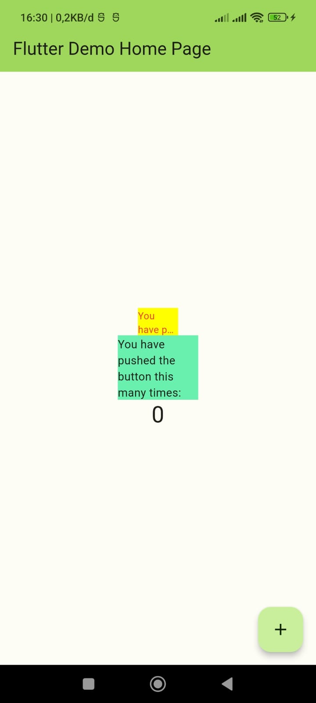

# Praktikum Minggu ke 10 - Manajemen Plugin

## File red_text_widget.dart
```dart
import 'package:auto_size_text/auto_size_text.dart';
import 'package:flutter/material.dart';

class RedTextWidget extends StatelessWidget {
  final String text;

  const RedTextWidget({Key? key, required this.text}) : super(key: key);

  @override
  Widget build(BuildContext context) {
    return AutoSizeText(
      text,
      style: const TextStyle(color: Colors.red, fontSize: 14),
      maxLines: 2,
      overflow: TextOverflow.ellipsis,
    );
  }
}
```

## File main.dart
```dart
import 'package:flutter/material.dart';
import 'package:flutter_plugin_pubdev/widgets/red_text_widget.dart';

void main() {
  runApp(const MyApp());
}

class MyApp extends StatelessWidget {
  const MyApp({super.key});

  // This widget is the root of your application.
  @override
  Widget build(BuildContext context) {
    return MaterialApp(
      title: 'Flutter Demo',
      debugShowCheckedModeBanner: false,
      theme: ThemeData(
        colorScheme: ColorScheme.fromSeed(seedColor: Colors.deepPurple),
        useMaterial3: true,
      ),
      home: const MyHomePage(title: 'Flutter Demo Home Page'),
    );
  }
}

class MyHomePage extends StatefulWidget {
  const MyHomePage({super.key, required this.title});

  final String title;

  @override
  State<MyHomePage> createState() => _MyHomePageState();
}

class _MyHomePageState extends State<MyHomePage> {
  int _counter = 0;

  void _incrementCounter() {
    setState(() {
      _counter++;
    });
  }

  @override
  Widget build(BuildContext context) {
    return Scaffold(
      appBar: AppBar(
        backgroundColor: Theme.of(context).colorScheme.inversePrimary,
        title: Text(widget.title),
      ),
      body: Center(
        child: Column(
          mainAxisAlignment: MainAxisAlignment.center,
          children: <Widget>[
            Container(
              color: Colors.yellowAccent,
              width: 50,
              child: const RedTextWidget(
                text: 'You have pushed the button this many times:',
              ),
            ),
            Container(
              color: Colors.greenAccent,
              width: 100,
              child: const Text(
                'You have pushed the button this many times:',
              ),
            ),
            Text(
              '$_counter',
              style: Theme.of(context).textTheme.headlineMedium,
            ),
          ],
        ),
      ),
      floatingActionButton: FloatingActionButton(
        onPressed: _incrementCounter,
        tooltip: 'Increment',
        child: const Icon(Icons.add),
      ), // This trailing comma makes auto-formatting nicer for build methods.
    );
  }
}
```

## Hasil Running
<p>  </p>


# Tugas Praktikum
#### 1. Selesaikan Praktikum tersebut, lalu dokumentasikan dan push ke repository Anda berupa screenshot hasil pekerjaan beserta penjelasannya di file README.md! 

Jawab: Done

#### 2. Jelaskan maksud dari langkah 2 pada praktikum tersebut!

Jawab: 
Langkah 2 pada praktikum tersebut penting untuk dilakukan karena plugin auto_size_text dapat membantu kita membuat teks di aplikasi Flutter dapat menyesuaikan ukurannya dengan ukuran layar perangkat. Hal ini akan membuat aplikasi Flutter kita terlihat lebih profesional dan nyaman digunakan.

#### 3. Jelaskan maksud dari langkah 5 pada praktikum tersebut!

Jawab:
final String text adalah di deklarasikan sebagai final untuk menunjukkan bahwa nilainya tidak dapat diubah setelah deklarasi. Variabel ini digunakan untuk menyimpan teks yang akan ditampilkan dalam widget.

Konstruktor RedTextWidget menerima dua parameter, yaitu key dan text. Parameter key digunakan untuk mengidentifikasi instance dari widget ini. Parameter text digunakan untuk menyimpan teks yang akan ditampilkan dalam widget. Parameter text diberi label required, yang berarti bahwa nilainya wajib diberikan saat membuat instance RedTextWidget. Nilai text ini akan digunakan untuk menampilkan teks dalam widget.

#### 4. Pada langkah 6 terdapat dua widget yang ditambahkan, jelaskan fungsi dan perbedaannya!

Jawab:
Widget pertama adalah Container yang mengandung instance dari widget RedTextWidget. Widget RedTextWidget ini digunakan untuk menampilkan teks dengan warna merah dan penyesuaian ukuran teks otomatis. Container pertama ini memiliki latar belakang berwarna kuning dan lebar 50 piksel.

Widget kedua juga merupakan Container, tetapi child-nya adalah instance dari widget Text. Widget Text ini digunakan untuk menampilkan teks dengan pengaturan default. Container kedua ini memiliki latar belakang berwarna hijau dan lebar 100 piksel.

#### 5. Jelaskan maksud dari tiap parameter yang ada di dalam plugin auto_size_text berdasarkan tautan pada dokumentasi [ini](https://pub.dev/documentation/auto_size_text/latest/) !

Jawab:
Widget AutoSizeText adalah widget yang digunakan untuk menampilkan teks dengan ukuran font yang disesuaikan secara otomatis. Widget ini memiliki empat parameter utama, yaitu:

- text: teks yang akan ditampilkan.
- style: properti yang digunakan untuk mengatur gaya teks, seperti warna dan ukuran font.
- maxLines: jumlah baris maksimum opsional untuk merentangkan teks.
- overflow: properti yang digunakan untuk mengontrol perilaku teks ketika melebihi jumlah baris yang telah ditetapkan pada parameter maxLines.